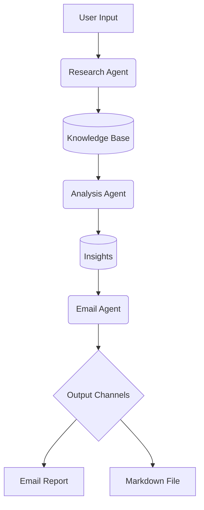

# AI Research Crew Pro

<div align="center">
  
  [](https://streamlit.io/)
  [](https://www.crewai.com/)
  [](https://gemini.google.com/)
  
  **Advanced Multi-Agent System for Automated Research & Reporting**
</div>

## 📥 Download README
[](https://raw.githubusercontent.com/yourusername/ai-research-crew-pro/main/README.md)

## 🌟 Features

<div align="center">
  <table>
    <tr>
      <td><b>🔍 Intelligent Research</b></td>
      <td>Automated web research with source verification</td>
    </tr>
    <tr>
      <td><b>📊 Smart Analysis</b></td>
      <td>Context-aware summarization and trend spotting</td>
    </tr>
    <tr>
      <td><b>✉️ Automated Reporting</b></td>
      <td>Professional email reports with Markdown formatting</td>
    </tr>
    <tr>
      <td><b>🤖 Multi-Agent Team</b></td>
      <td>Specialized AI agents working in coordination</td>
    </tr>
  </table>
</div>

## 🚀 Quick Start

### Prerequisites
- Python 3.10+
- Google Gemini API key
- Serper API key (for web search)
- SMTP credentials

### Installation
```bash
# Clone the repository
git clone https://github.com/yourusername/ai-research-crew-pro.git
cd ai-research-crew-pro

# Install dependencies
pip install -r requirements.txt

# Set up environment variables
cp .env.example .env
# Edit .env with your credentials
```

## 🏗️ System Architecture




